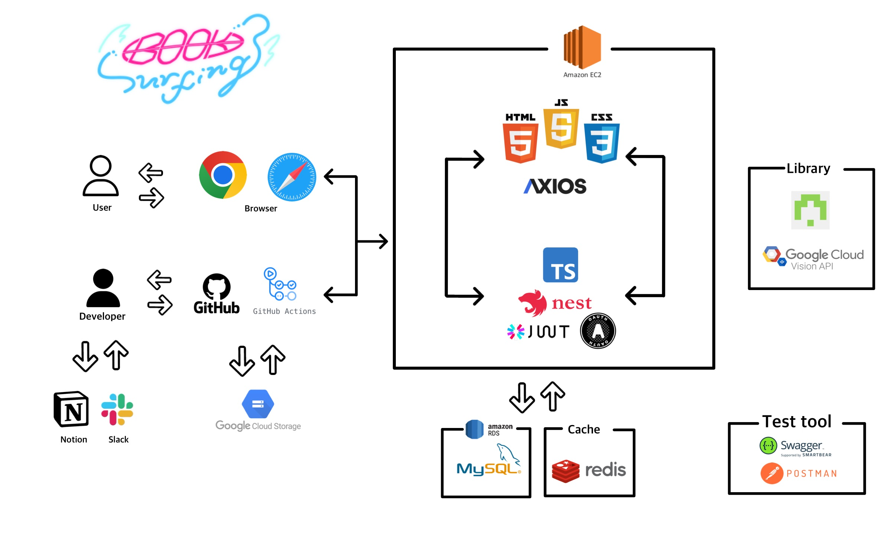
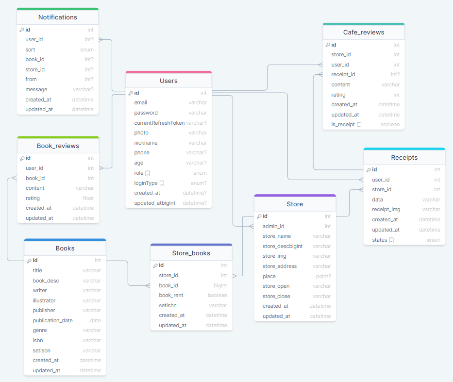

# 📌목차

1. [📄프로젝트 설명](#-프로젝트-설명)
2. [📚기술스택](#-기술-스택)
3. [🔧아키텍쳐](#-아키텍쳐)
4. [🏗️ERD](#-ERD)
5. [⚠️트러블 슈팅](#-트러블-슈팅)
6. [🎥시연 영상](#-시연-영상)
7. [🍏환경 변수](#-환경-변수)
8. [👥팀 소개](#-팀-소개)

 

# 📄 프로젝트 설명

### 📚북서핑(BOOKSURFING)

내가 찾는 만화와 만화카페를 내 주변에서 검색하고 찾을 수 있는 서비스입니다. 만화를 좋아하는 사람들을 위해 내 주변에서 내가 찾는 만화책을 볼 수 있는지 알고싶다는 생각 하나로 북서핑(BOOKSURFING) 서비스를 기획하게 되었습니다.

 
 

## 🚀 서비스 링크

    🌊🌊🌊 <a href="https://www.booksurfing.store">북서핑(BOOKSUFRING)</a> 🌊🌊🌊

 
 

## 📕 주요기능

사용자들에게 리뷰 기반의 도서 추천과 주변 운영매장 정보를 제공하여 만화 팬들의 니즈 충족과 활성화를 도모하며, 위시리스트 및 알람 기능으로 사용자 편의성을 강화합니다.

   
 <b>1. 추천 도서목록과 내 주변 운영매장 확인 가능</b>  (👈 Click)

 

- 추천 도서목록은 유저들의 리뷰순으로 선정되며 메인페이지의 슬라이드를 통해 확인할 수 있습니다.
- 메인페이지 하단의 운영매장은 북서핑과 제휴된 지점매장들이며 각 매장의 운영시간, 메뉴, 소장도서 등의 정보를 확인 가능합니다.
- 헤더의 BOOKCAFE를 누르면 반경 3km 이내의 내 주변 운영매장을 알 수 있습니다.

   
 <b>2. 지점리뷰와 도서 리뷰 작성 및 조회</b>  (👈 Click)

 

- 지점리뷰와 도서리뷰는 유저들만 작성이 가능합니다.
- 지점 리뷰는 일반 리뷰와 영수증 리뷰로 나뉘어서 작성이 가능합니다. 영수증 리뷰를 통해 더욱 신뢰도 있는 지점을 알 수 있습니다.

   
 <b>3. 위시리스트 등록 및 알람 기능
</b>  (👈 Click)

 

- 유저는 원하는 도서와 지점을 위시리스트에 등록 가능합니다.
- 만약 원하는 도서가 원하는 지점에 입고되었을때 자동으로 유저에게 알람이 갑니다.

   
 <b>4. 유저 지점사장 신청 및 CSV 도서등록 가능
</b>  (👈 Click)

 

- 유저는 지점사장으로 신청폼을 제출하고 관리자의 심사 하에 지점사장으로 전환이 가능합니다.
- 지점 사장은 지점 수정에서 CSV로 간편하게 도서등록이 가능합니다.

 
 

# 📚 기술 스택

### ⚡ Frontend

    
    
    
    
    

### ⚡ Backend

   
    
    
    
    
   

   
  

### ⚡ Database

    
    
    
    

### ⚡ DevOps

    
  
    
   

 
  
  

### ⚡ Tools

    
    
      
         

 
 

# 🔧 아키텍쳐

 
 
 

# 🏗️ ERD

이해를 돕기위해 간소화한 ERD 입니다.

 
 

# ⚠️ 트러블 슈팅

  
 트러블슈팅1: <b>구글 스토리지 버킷</b> (👈 Click)

 

### 문제점

1. **AWS S3 이미지 업로드로 메모리 부족:**
   - EC2 서버에서 AWS S3 버킷을 사용하여 이미지 업로드 시, 메모리 부족 문제로 서버 실행이 불가능한 상황.
2. **AWS-SDK 버전 메모리 누수 현상:**
   - 현재 사용 중인 AWS-SDK 버전에서 발생하는 메모리 누수로 인한 문제 확인.

### **해결방안 및 의사결정**

1. **선택1 - S3 버킷 전용 라이브러리 사용:**
   - AWS-SDK 대신 S3 버킷 전용 라이브러리를 도입하여 메모리 부족 현상을 해결.
2. **선택2 - 구글 스토리지 버킷 사용:**
   - 구글 스토리지 버킷을 채택하여 이미지 업로드 시 메모리 부족 문제를 해결.

### **구현 계획**

1. **선택1 - S3 버킷 전용 라이브러리 도입:**
   - 현재 사용 중인 AWS-SDK 대신 S3 전용 라이브러리를 도입하여 이미지 업로드 로직 수정.
   - 새로운 라이브러리가 메모리를 효율적으로 사용하도록 확인 후 반영.
2. **선택2 - 구글 스토리지 버킷 채택:**
   - 구글 스토리지 버킷을 프로젝트에 통합하고 이미지 업로드 관련 코드 수정.
   - 구글 스토리지를 통해 이미지 업로드 시 메모리 부족 문제 확인 후 조치.

### **예상 효과**

1. **메모리 부족 현상 개선:**
   - 선택한 방법에 따라 메모리 부족 문제를 효과적으로 해결하여 EC2 서버가 안정적으로 실행될 것으로 기대.
2. **AWS-SDK 메모리 누수 해소:**
   - 새로운 이미지 업로드 라이브러리 도입으로 AWS-SDK 버전에서 발생한 메모리 누수 문제를 해결.
3. **성능 향상:**
   - 선택한 방법에 따라 이미지 업로드 성능이 향상되어 사용자 경험을 개선할 것으로 예상.
   

  
 트러블슈팅2: <b>Redis</b> (👈 Click)

 

### **문제점**

도서 데이터를 DB에서 불러오는 과정에서 대량의 데이터를 처리하는 데 시간이 소요되어 사용자 경험이 저하됐다.

### **해결방안 및 의사결정**

**도서 데이터 조회 성능 개선:**

1. **SQL 쿼리문 활용**

- 데이터베이스 쿼리문에서 불필요한 데이터를 최소화하고, 필요한 데이터만을 선택적으로 가져올 수 있도록 SQL 쿼리문을 최적화한다.
- 특정 검색어에 해당하는 도서의 id, 타이틀과 이미지 URL만을 선택하여 가져오도록 수정해서 가져오는 데이터 양을 최소화한다.

2. **Redis 캐싱 기능 활용:**

- 검색어를 키로 사용하여 도서 데이터의 일부를 Redis에 캐시로 저장한다.
- 사용자가 도서를 검색할 때, 먼저 Redis 캐시에서 데이터를 찾고, 없을 경우 DB에서 최적화된 데이터를 가져와서 Redis에 저장한다.
- 캐시 만료 기간을 설정하여 주기적으로 데이터를 갱신하도록 한다.

### **구현 계획**

1. **도서 데이터 조회 성능 개선:**

- SQL 쿼리문을 수정하여 필요한 데이터만을 효율적으로 가져오도록 최적화한다.
- 가져오는 데이터 양을 최소화하여 성능 향상을 기대할 수 있도록 한다.

1. **Redis 캐싱 구현:**

- 검색 시 Redis에 캐시된 데이터가 있는지 확인하고, 없으면 DB에서 데이터를 가져와서 Redis에 저장하는 로직을 개발한다.
- Redis에 저장되는 키는 검색어로, 값은 해당 도서 데이터로 한다.
- 캐시 만료 기간은 2분으로 설정함.

### **예상 효과**

**데이터 로드 속도 향상:**

- 효율적인 SQL 쿼리문과 최소한의 필수 데이터만을 가져오는 방식으로 데이터 로드 속도를 향상시켜 사용자 경험을 개선합니다.
- Redis 캐싱을 통해 반복적인 요청에 대한 성능 향상을 기대할 수 있습니다.
   

 

  
 트러블슈팅3: <b>영수증 조작 이슈</b> (👈 Click)

 

OCR 선정 이유

## 

OCR 중에서 비교해 보니 종합적으로 google cloud vision이 제일 적합하다고 느꼈다.

### 문제점

**1. 영수증 조작 문제**

OCR은 사진을 텍스트로 변환 하는 것이므로 영수증에 들어갈만한 keyword인지 판별 후 가져오는 것으로 코드를 작성하였다.

만약 해당 키워드가 포함되면 모두 영수증으로 인식 후, 가게명, 주소가 같다면 종이 위조 영수증도 영수증으로 인식된다.

또한, 환불 영수증에 대한 따로 유효성 처리가 없다.

### **해결방안 및 의사결정**

1. **영수증 패턴인식 모델 학습**

- 영수증 데이터 정보를 인식시켜서 학습시키는 방법을 생각했지만, 실제적으로 실현되기 어렵다.

1. **영수증 전용 템플릿 이용하기**

- Azure Document Intelligence 와 같이 영수증 전용 템플릿을 사용하려고 하였으나 영수증 전용 템플릿은 올리는 사진이 영수증이라는 가정하에 적힌 정보를 추출해내므로 keyword 처리만 없을 뿐 위조가 가능하다는 문제가 발생한다.

1.  **영수증을 직접 관리자가 확인 하기**

- 사용자가 영수증을 올리면 관리자에게 영수증 사진이 보내지게 되며 관리자가 확인 후 영수증을 승인하는 방식이다.

위의 해결방안 중 위조방지를 위해 영수증을 직접 관리자가 확인하는 과정이 필수이므로 영수증 전용 템플릿을 이용하기 보다는 키워드로 영수증 여부를 확인하는 코드에서 **영수증을 직접 관리자가 확인 하는 코드를 추가하는 것을 선택하였습니다.**

### 구현 계획

1. **Google storage에 영수증 사진을 저장:**

- 사진을 올리면 Google storage에 사진파일을 저장

1. **저장된 영수증 사진을 Slack으로 전송:**

- 영수증 키워드 판별, 일치하는 가게 정보 및 주소, 중복영수증 판별 조건 통과 시 slack으로 사진과 DB에 저장된 id 값 전송

1. **영수증 판별:**

- Slack 알림을 통해 관리자가 영수증 상태(승인, 미승인)을 변경하는 로직 추가

### 예상 효과

1. **위조된 영수증 판별:**

영수증을 관리자가 확인함으로 인해 위조된 영수증 판별이 가능

 

 

  
 트러블슈팅4: <b>wkx/parser</b> (👈 Click)

 

### 문제점

TypeORM을 이용하면 MySQL에 위치값을 나타내는 형식인 Point(x, y) 값을 집어넣을 수 없는 문제

### 해결방안

TypeORM에서 지원하는 Queryselector를 이용해 실제 SQL 쿼리와 비슷한 형태로 값을 집어넣는 방안(wkx)

저장된 값을 그대로 사용할 수 없어 Point를 **Parser 라이브러리**를 이용해 거리 계산 및 주변 지점 찾기 기능 완성

 

  
 트러블슈팅5: <b>소셜로그인</b> (👈 Click)

 

### **문제점**

1. **보안 이슈 - URL에 토큰 노출:**
   - 현재 소셜 로그인에서는 URL을 통해 access token과 refresh token을 전송하고 있습니다. 이는 보안상 취약점을 가지고 있습니다.
2. **쿠키를 통한 로그인 이슈:**
   - 기존에 JWT를 사용하여 사용자 인증을 진행하던 중, 소셜 로그인에서는 쿠키를 사용하여 토큰을 받는 과정이 추가되어 있습니다.
3. **HTML 및 로직 불일치:**
   - 로그인 성공시 받아주는 HTML이 없이 로직만이 구현되어 있습니다. 이로 인해 사용자에게 적절한 응답 및 사용자 경험이 미흡합니다.

### **해결방안 및 의사결정**

1. **JWT 기반 소셜 로그인으로의 전환:**
   - 현재의 보안 이슈와 사용자 인증 방식의 일관성을 위해, 소셜 로그인에서도 JWT를 사용하여 인증하도록 변경하기로 결정했습니다.
   - 소셜 로그인 후에도 JWT를 통해 토큰을 안전하게 전달하고 관리할 수 있습니다.
2. **Redis 활용하여 코드와 사용자 ID 저장:**
   - 소셜 로그인 시 발급된 코드와 사용자 ID를 Redis에 저장하는 로직을 추가합니다. 이를 통해 나중에 해당 코드를 이용해 사용자를 확인할 수 있습니다.
3. **HTML 및 사용자 응답 강화:**
   - 로그인 성공시 받아주는 HTML 페이지와 로직을 개선하여, 사용자에게 적절한 응답을 제공하고 사용자 경험을 향상시킬 수 있도록 합니다.

### **구현 계획**

1. **JWT 기반 소셜 로그인 구현:**
   - 소셜 로그인에서 JWT를 사용하여 토큰을 안전하게 전달하기 위한 코드 및 로직을 구현합니다.
2. **Redis를 활용한 코드 및 사용자 ID 저장 로직 추가:**
   - 소셜 로그인 시 발급된 코드와 사용자 ID를 Redis에 저장하고, 이를 통해 나중에 인증을 진행합니다. 만료기간은 30초로 설정합니다.
3. **HTML 및 로직 개선:**
   - 로그인 성공시 사용자에게 적절한 HTML 페이지를 제공하고, 로직을 개선하여 응답의 일관성을 확보합니다.

### **예상 효과**

1. **보안 강화:**
   - URL에 노출되는 토큰 문제를 해결하고, JWT를 통해 안전하게 사용자 인증을 수행하여 보안성을 강화합니다.
2. **일관된 사용자 인증 메커니즘:** - 모든 로그인 방식에서 JWT를 사용하여 사용자 인증을 일관되게 처리함으로써 개발 및 유지보수의 효율성을 향상시킵니다.

 
 

## 🎥 시연 영상

[[🎞시연 영상]](https://youtu.be/h2sHEe_xnmU?si=SxImY96eu9YnSxGP)

## 🍏 환경 변수

  
 <b>환경 변수 설정</b> (👈 Click)

 

다음은 프로젝트를 실행하기 위해 필요한 환경 변수들입니다. 프로젝트를 실행하기 전에 이 변수들을 설정해야 합니다.

## Database 설정

- **DATABASE_HOST**: 데이터베이스 호스트
- **DATABASE_PORT**: 데이터베이스 포트
- **DATABASE_USERNAME**: 데이터베이스 사용자 이름
- **DATABASE_PASSWORD**: 데이터베이스 암호
- **DATABASE_NAME**: 데이터베이스 이름
- **DATABASE_SYNC**: 데이터베이스 동기화 여부

## Google 스토리지 설정

- **GOOGLE_DATABASE_HOST**: Google 스토리지 호스트
- **GOOGLE_DATABASE_PORT**: Google 스토리지 포트
- **GOOGLE_DATABASE_USERNAME**: Google 스토리지 사용자 이름
- **GOOGLE_DATABASE_PASSWORD**: Google 스토리지 암호
- **GOOGLE_DATABASE_NAME**: Google 스토리지 이름
- **GOOGLE_DATABASE_SYNC**: Google 스토리지 동기화 여부

## 서버 설정

- **SERVER_PORT**: 서버 포트

## JWT 토큰 설정

- **JWT_ACCESS_TOKEN_SECRET**: 액세스 토큰 비밀키
- **JWT_ACCESS_TOKEN_EXP**: 액세스 토큰 만료 시간
- **JWT_REFRESH_TOKEN_SECRET**: 리프레시 토큰 비밀키
- **JWT_REFRESH_TOKEN_EXP**: 리프레시 토큰 만료 시간

## AWS 설정

- **AWS_ACCESS_KEY_ID**: AWS 액세스 키 ID
- **AWS_SECRET_ACCESS_KEY**: AWS 비밀 액세스 키
- **AWS_S3_BUCKET**: AWS S3 버킷 이름

## Google Cloud 설정

- **GOOGLE_PROJECTID**: Google Cloud 프로젝트 ID
- **GOOGLE_BUCKET_NAME**: Google Cloud 버킷 이름
- **KEYFILE**: Google Cloud 키 파일 경로

## 카카오 소셜 로그인 설정

- **KAKAO_CLIENT_ID**: 카카오 클라이언트 ID
- **KAKAO_CLIENT_SECRET**: 카카오 클라이언트 시크릿
- **KAKAO_REDIRECT_URI**: 카카오 리디렉션 URI
- **KAKAO_ADMIN_REDIRECT_URI**: 카카오 관리자 리디렉션 URI

## 네이버 소셜 로그인 설정

- **NAVER_CLIENT_ID**: 네이버 클라이언트 ID
- **NAVER_CLIENT_SECRET**: 네이버 클라이언트 시크릿
- **NAVER_REDIRECT_URI**: 네이버 리디렉션 URI
- **NAVER_ADMIN_REDIRECT_URI**: 네이버 관리자 리디렉션 URI

## Redis 설정

- **REDIS_USERNAME**: Redis 사용자 이름
- **REDIS_HOST**: Redis 호스트
- **REDIS_PORT**: Redis 포트
- **REDIS_PASSWORD**: Redis 암호
- **REDIS_EXPIRATION_TIME_SECONDS**: Redis 만료 시간(초)
- **REDIS_CODE_EXPIRATION_TIME_SECONDS**: Redis 코드 만료 시간(초)

## 메일 설정

- **MAIL_USER**: 메일 사용자 이름
- **MAIL_PASS**: 메일 비밀번호

## Book API 키

- **book_api**: Book API 키

## 영수증 OCR 설정

- **receipt_projectId**: OCR 프로젝트 ID
- **receipt_BUCKET_NAME**: OCR 버킷 이름
- **receit_keyfile**: OCR 키 파일 경로

## Slack 설정

- **slack_token**: Slack 토큰
- **slack_conversationId**: Slack 채널 ID

 
 

## 👋 팀 소개

### 🐰 FIVE BUNNIES

<table>
  <tbody>
    <tr align="center">
      <td align="center"> </td>
      <td align="center"> </td>
      <td align="center"> </td>
      <td align="center"> </td>
      <td align="center"> </td>
      
   
  </tr>
  <tr align="center">
  <td width="300"><a href="https://github.com/gyusungjung">팀장 : 정규성 </a></td>
  <td width="300"><a href="https://github.com/DevThive">부팀장 : 이동하</a></td>
  <td width="300"><a href="https://github.com/songowen">팀원 : 송창현</a></td>
  <td width="300"><a href="https://github.com/hhsukyu">팀원 : 한수경</a></td>
  <td width="300"><a href="https://github.com/precipice-">팀원 : 이주영</a></td>
  </tr>
     <tr align="center" height="200">
    <td>
      마이페이지, 도서 리뷰, 알림 CRUD 
    </td>
    <td>
    메뉴, 스토어 CRUD 
    CI/CD  
    로그인 회원가입 
      결제기능 
      Front axios 작업 
     
    </td>
    <td>
      네이버,카카오 소셜로그인 
      도서,지점도서CRUD 
      유저지점사장전환 (C) 
      비밀번호찾기기능 
      검색어 TOP10 랭킹 기능 
    </td>
    <td>
      영수증인증 리뷰 등록(C) 
      사장님 리뷰 CRUD 
      도서 CSV로 등록(C) 
    </td>
       <td>
      지점 이용 후기 CRUD 
        지도 기능 개발 
    </td>
  </tr>
  </tbody>
</table>

 
 
